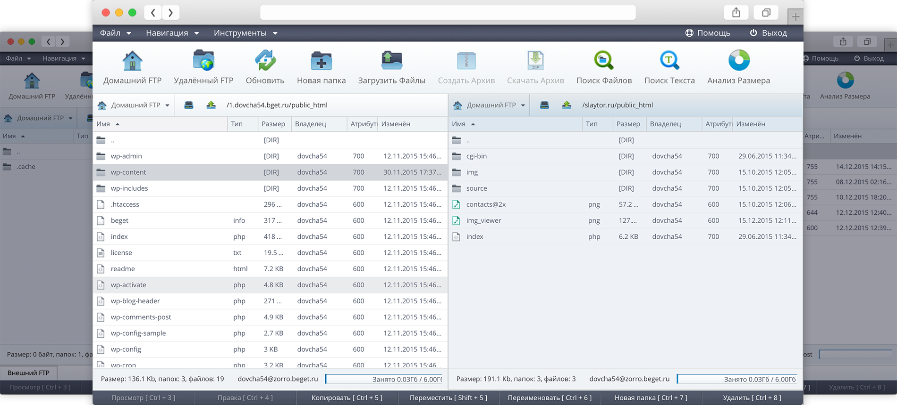

[](https://travis-ci.org/LTD-Beget/sprutio)

## Sprut.io Open Source File Manager

### Project web site:
 * https://sprut.io/en

### Top features:

 * 2 panel interface with drag and drop features
 * Fluent code editor, with a variaety of custom themes
 * Can search filenames or even text in a given path
 * Supports hotkeys
 * Able to view images

### Demo
 * https://demo.sprut.io:9443
 * login:    demo
 * password: demo
 
### Requirements

 * Docker [(install guide)](https://docs.docker.com/engine/installation/)
 * At least 1.5gb hard drive space
 
After installing all prerequisites 

1) Download the installer

```*.sh
user@host:~$ wget https://raw.githubusercontent.com/LTD-Beget/sprutio/master/run.sh
```

2) Grant the apropriate permissions

```*.sh
user@host:~$ chmod +x run.sh
```

3) Run the script

```*.sh
user@host:~$ ./run.sh
```

It will be running around 10 to 15 minutes on average, great opportunity to drink some tea.

After the installation Docker containers will be started, you can check their status using:

```*.sh
user@host:~$ docker ps

CONTAINER ID   IMAGE                  COMMAND                    NAMES
57cc6c3c2e2b   beget/sprutio-nginx    "nginx -g 'daemon off"     sprutio_nginx_1
3fbc26a6ecc1   beget/sprutio-app      "/init"                    sprutio_app_1
d6d539b09e5a   beget/sprutio-rpc      "/init"                    sprutio_rpc_1
41b22463e99a   beget/sprutio-cron     "/init"                    sprutio_cron_1
2ea18de7d54b   redis:3.0              "/entrypoint.sh redis"     sprutio_redis_
```


Sprut.io will now be available over https on the following IP-address:

```*.sh
user@host:~$ https://YOUR_SERVER_IP:9443
```

To log in, please use any of your system's credentials

The file manager will use the default self-signed SSL certificate, to use any other, drop it in the "ssl" folder

### Screenshot 



We wish you great achievements with our product.

Sprut.io Team.
